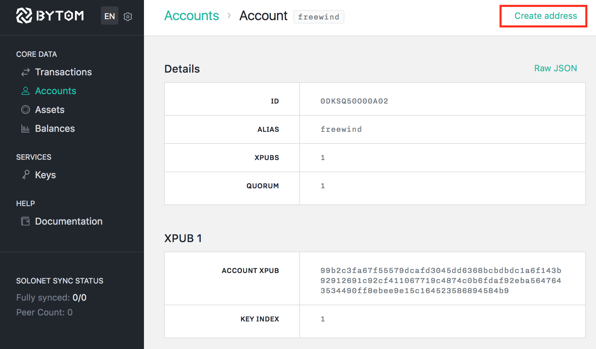
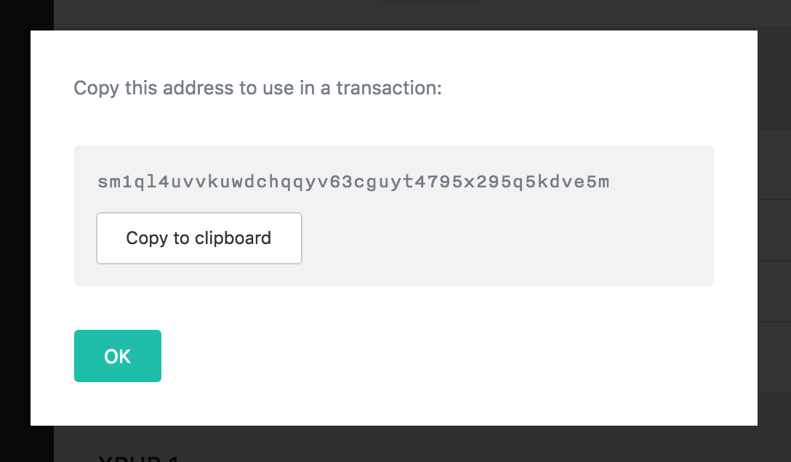

比原是如何通过`/create-account-receiver`创建地址的？
==============================================

在比原的dashboard中，我们可以为一个帐户创建地址(address)，这样就可以在两个地址之间转帐了。在本文，我们将结合代码先研究一下，比原是如何创建一个地址的。

首先看看我们在dashboard中的是如何操作的。

我们可以点击左侧的"Accounts"，在右边显示我的帐户信息。注意右上角有一个“Create Address”链接：



点击后，比原会为我当前选择的这个帐户生成一个地址，马上就可以使用了：



本文我们就要研究一下这个过程是怎么实现的，分成了两个小问题：

1. 前端是如何向后台接口发送请求的？
2. 比原后台是如何创建地址的？

前端是如何向后台接口发送请求的？
--------------------------

在前一篇文章中，我们也是先从前端开始，在React组件中一步步找到了使用了接口，以前发送的数据。由于这些过程比较相似，在本文我们就简化了，直接给出找到的代码。

首先是页面中的"Create Address"对应的React组件：

https://github.com/Bytom/dashboard/blob/0cc300fd0a9cbc52940b2d5119cf05230392a75f/src/features/accounts/components/AccountShow.jsx#L12-L132

```js
class AccountShow extends BaseShow {
  // ...
  // 2. 
  createAddress() {
    // ...
    // 3. 
    this.props.createAddress({
      account_alias: this.props.item.alias
    }).then(({data}) => {
      this.listAddress()
      this.props.showModal(<div>
        <p>{lang === 'zh' ? '拷贝这个地址以用于交易中：' : 'Copy this address to use in a transaction:'}</p>
        <CopyableBlock value={data.address} lang={lang}/>
      </div>)
    })
  }

  render() {
      // ...
      view = 
        <PageTitle
          title={title}
          actions={[
            // 1.
            <button className='btn btn-link' onClick={this.createAddress}>
              {lang === 'zh' ? '新建地址' : 'Create address'}
            </button>,
          ]}
        />
       // ...
    }
    // ...
  }
}
```

上面的第1处就是"Create Address"链接对应的代码，它实际上是一个Button，当点击后，会调用`createAddress`方法。而第2处就是这个`createAddress`方法，在它里面的第3处，又将调用`this.props.createAddress`，也就是由外部传进来的`createAddress`函数。同时，它还要发送一个参数`account_alias`，它对应就是当前帐户的alias。

继续可以找到`createAddress`的定义：

https://github.com/Bytom/dashboard/blob/674d3b1be8ec420d75f0ab0b792fd97e11ffe352/src/sdk/api/accounts.js#L3-L32

```js
const accountsAPI = (client) => {
  return {
    // ...
    createAddress: (params, cb) => shared.create(client, '/create-account-receiver', params, {cb, skipArray: true}),
    // ...
  }
}
```

可以看到，它调用的比原接口是`/create-account-receiver`。

然后我们就将进入比原后台。

比原后台是如何创建地址的？
---------------------

在比原的代码中，我们可以找到接口`/create-account-receiver`对应的handler:

[api/api.go#L164-L174](https://github.com/freewind/bytom-v1.0.1/blob/master/api/api.go#L164-L174)

```go
func (a *API) buildHandler() {
    // ...
    if a.wallet != nil {
        // ...
        m.Handle("/create-account-receiver", jsonHandler(a.createAccountReceiver))
```

原来是`a.createAccountReceiver`。我们继续进去：

[api/receivers.go#L9-L32](https://github.com/freewind/bytom-v1.0.1/blob/master/api/receivers.go#L9-L32)

```go
// 1.
func (a *API) createAccountReceiver(ctx context.Context, ins struct {
    AccountID    string `json:"account_id"`
    AccountAlias string `json:"account_alias"`
}) Response {

    // 2.
    accountID := ins.AccountID
    if ins.AccountAlias != "" {
        account, err := a.wallet.AccountMgr.FindByAlias(ctx, ins.AccountAlias)
        if err != nil {
            return NewErrorResponse(err)
        }
        accountID = account.ID
    }

    // 3.
    program, err := a.wallet.AccountMgr.CreateAddress(ctx, accountID, false)
    if err != nil {
        return NewErrorResponse(err)
    }

    // 4. 
    return NewSuccessResponse(&txbuilder.Receiver{
        ControlProgram: program.ControlProgram,
        Address:        program.Address,
    })
}
```

方法中的代码可以分成4块，看起来还是比较清楚：

1. 第1块的关注点主要在参数这块。可以看到，这个接口可以接收2个参数`account_id`和`account_alias`，但是刚才的前端代码中传过来了`account_alias`这一个，怎么回事？
2. 从第2块这里可以看出，如果传了`account_alias`这个参数，则会以它为准，用它去查找相应的account，再拿到相应的id。否则的话，才使用`account_id`当作account的id
3. 第3块是为`accountID`相应的account创建一个地址
4. 第4块返回成功信息，经由外面的`jsonHandler`转换为JSON对象后发给前端

这里面，需要我们关注的只有两个方法，即第2块中的`a.wallet.AccountMgr.FindByAlias`和第3块中的`a.wallet.AccountMgr.CreateAddress`，我们依次研究。

### `a.wallet.AccountMgr.FindByAlias`

直接上代码：

[account/accounts.go#L176-L195](https://github.com/freewind/bytom-v1.0.1/blob/master/account/accounts.go#L176-L195)

```go
// FindByAlias retrieves an account's Signer record by its alias
func (m *Manager) FindByAlias(ctx context.Context, alias string) (*Account, error) {
    // 1. 
    m.cacheMu.Lock()
    cachedID, ok := m.aliasCache.Get(alias)
    m.cacheMu.Unlock()
    if ok {
        return m.FindByID(ctx, cachedID.(string))
    }

    // 2. 
    rawID := m.db.Get(aliasKey(alias))
    if rawID == nil {
        return nil, ErrFindAccount
    }

    // 3.
    accountID := string(rawID)
    m.cacheMu.Lock()
    m.aliasCache.Add(alias, accountID)
    m.cacheMu.Unlock()
    return m.FindByID(ctx, accountID)
}
```

该方法的结构同样比较简单，分成了3块：

1. 直接用alias在内存缓存`aliasCache`里找相应的id，找到的话调用`FindByID`找出完整的account数据
2. 如果cache中没找到，则将该alias变成数据库需要的形式，在数据库里找id。如果找不到，报错
3. 找到的话，把alias和id放在内存cache中，以备后用，同时调用`FindByID`找出完整的account数据

上面提到的`aliasCache`是定义于`Manager`类型中的一个字段：

[account/accounts.go#L78-L85](https://github.com/freewind/bytom-v1.0.1/blob/master/account/accounts.go#L78-L85)

```go
type Manager struct {
    // ...
    aliasCache *lru.Cache
```

`lru.Cache`是由Go语言提供的，我们就不深究了。

然后就是用到多次的`FindByID`：

[account/accounts.go#L197-L220](https://github.com/freewind/bytom-v1.0.1/blob/master/account/accounts.go#L197-L220)

```go
// FindByID returns an account's Signer record by its ID.
func (m *Manager) FindByID(ctx context.Context, id string) (*Account, error) {
    // 1. 
    m.cacheMu.Lock()
    cachedAccount, ok := m.cache.Get(id)
    m.cacheMu.Unlock()
    if ok {
        return cachedAccount.(*Account), nil
    }

    // 2.
    rawAccount := m.db.Get(Key(id))
    if rawAccount == nil {
        return nil, ErrFindAccount
    }

    // 3.
    account := &Account{}
    if err := json.Unmarshal(rawAccount, account); err != nil {
        return nil, err
    }

    // 4.
    m.cacheMu.Lock()
    m.cache.Add(id, account)
    m.cacheMu.Unlock()
    return account, nil
}
```

这个方法跟前面的套路一样，也比较清楚：

1. 先在内存缓存`cache`中找，找到就直接返回。`m.cache`也是定义于`Manager`中的一个`lru.Cache`对象
2. 内存缓存中没有，就到数据库里找，根据id找到相应的JSON格式的account对象数据
3. 把JSON格式的数据变成`Account`类型的数据，也就是前面需要的
4. 把它放到内存缓存`cache`中，以`id`为key

这里感觉没什么说的，因为基本上在前一篇都涉及到了。

### `a.wallet.AccountMgr.CreateAddress`

继续看生成地址的方法：

[account/accounts.go#L239-L246](https://github.com/freewind/bytom-v1.0.1/blob/master/account/accounts.go#L239-L246)

```go
// CreateAddress generate an address for the select account
func (m *Manager) CreateAddress(ctx context.Context, accountID string, change bool) (cp *CtrlProgram, err error) {
    account, err := m.FindByID(ctx, accountID)
    if err != nil {
        return nil, err
    }
    return m.createAddress(ctx, account, change)
}
```

由于这个方法里传过来的是`accountID`而不是`account`对象，所以还需要再用`FindByID`查一遍，然后，再调用`createAddress`这个私有方法创建地址：

[account/accounts.go#L248-L263](https://github.com/freewind/bytom-v1.0.1/blob/master/account/accounts.go#L248-L263)

```go
// 1.
func (m *Manager) createAddress(ctx context.Context, account *Account, change bool) (cp *CtrlProgram, err error) {
    // 2. 
    if len(account.XPubs) == 1 {
        cp, err = m.createP2PKH(ctx, account, change)
    } else {
        cp, err = m.createP2SH(ctx, account, change)
    }
    if err != nil {
        return nil, err
    }
    // 3.
    if err = m.insertAccountControlProgram(ctx, cp); err != nil {
        return nil, err
    }
    return cp, nil
}
```

该方法可以分成3部分：

1. 在第1块中主要关注的是返回值。方法名为`CreateAddress`，但是返回值或者`CtrlProgram`，那么`Address`在哪儿？实际上`Address`是`CtrlProgram`中的一个字段，所以调用者可以拿到Address
2. 在第2块代码这里有一个新的发现，原来一个帐户是可以有多个密钥对的（提醒：在椭圆算法中一个私钥只能有一个公钥）。因为这里将根据该account所拥有的公钥数量不同，调用不同的方法。如果公钥数量为1，说明该帐户是一个独享帐户（由一个密钥管理），将调用`m.createP2PKH`；否则的话，说明这个帐户由多个公钥共同管理（可能是一个联合帐户），需要调用`m.createP2SH`。这两个方法，返回的对象`cp`，指的是`ControlProgram`，强调了它是一种控制程序，而不是一个地址，地址`Address`只是它的一个字段
3. 创建好以后，把该控制程序插入到该帐户中

我们先看第2块代码中的帐户只有一个密钥的情况，所调用的方法为`createP2PKH`：

[account/accounts.go#L265-L290](https://github.com/freewind/bytom-v1.0.1/blob/master/account/accounts.go#L265-L290)

```go
func (m *Manager) createP2PKH(ctx context.Context, account *Account, change bool) (*CtrlProgram, error) {
    idx := m.getNextContractIndex(account.ID)
    path := signers.Path(account.Signer, signers.AccountKeySpace, idx)
    derivedXPubs := chainkd.DeriveXPubs(account.XPubs, path)
    derivedPK := derivedXPubs[0].PublicKey()
    pubHash := crypto.Ripemd160(derivedPK)

    // TODO: pass different params due to config
    address, err := common.NewAddressWitnessPubKeyHash(pubHash, &consensus.ActiveNetParams)
    if err != nil {
        return nil, err
    }

    control, err := vmutil.P2WPKHProgram([]byte(pubHash))
    if err != nil {
        return nil, err
    }

    return &CtrlProgram{
        AccountID:      account.ID,
        Address:        address.EncodeAddress(),
        KeyIndex:       idx,
        ControlProgram: control,
        Change:         change,
    }, nil
}
```

不好意思，这个方法的代码一看我就搞不定了，看起来是触及到了比较比原链中比较核心的地方。我们很难通过这几行代码以及快速的查阅来对它进行合理的解释，所以本篇只能跳过，以后再专门研究。同样，`m.createP2SH`也是一样的，我们也先跳过。我们早晚要把这一块解决的，请等待。

我们继续看第3块中`m.insertAccountControlProgram`方法：

[account/accounts.go#L332-L344](https://github.com/freewind/bytom-v1.0.1/blob/master/account/accounts.go#L332-L344)

```go
func (m *Manager) insertAccountControlProgram(ctx context.Context, progs ...*CtrlProgram) error {
    var hash common.Hash
    for _, prog := range progs {
        accountCP, err := json.Marshal(prog)
        if err != nil {
            return err
        }

        sha3pool.Sum256(hash[:], prog.ControlProgram)
        m.db.Set(ContractKey(hash), accountCP)
    }
    return nil
}
```

这个方法看起来就容易多了，主要是把前面创建好的`CtrlProgram`传过来，对它进行保存数据库的操作。注意这个方法的第2个参数是`...*CtrlProgram`，它是一个可变参数，不过在本文中用到的时候，只传了一个值（在其它使用的地方有传入多个的）。

在方法中，对`progs`进行变量，对其中的每一个，都先把它转换成JSON格式，然后再对它进行摘要，最后通过`ContractKey`函数给摘要加一个`Contract:`的前缀，放在数据库中。这里的`m.db`在之前文章中分析过，它就是那个名为`wallet`的leveldb数据库。这个数据库的Key挺杂的，保存了各种类型的数据，以前缀区分。

我们看一下`ContractKey`函数，很简单：

[account/accounts.go#L57-L59](https://github.com/freewind/bytom-v1.0.1/blob/master/account/accounts.go#L57-L59)

```go
func ContractKey(hash common.Hash) []byte {
    return append(contractPrefix, hash[:]...)
}
```

其中的`contractPrefix`为常量`[]byte("Contract:")`。从这个名字我们可以又将接触到一个新的概念：合约(Contract)，看来前面的`CtrlProgram`就是一个合约，而帐户只是合约中的一部分（是否如此，留待我们以后验证）

写到这里，我觉得这次要解决的问题“比原是如何通过`/create-account-receiver`创建地址的”已经解决的差不多了。

虽然很遗憾在过程中遇到的与核心相关的问题，比如创建地址的细节，我们目前还没法理解，但是我们又再一次触及到了核心。在之前的文章中我说过，比原的核心部分是很复杂的，所以我将尝试多种从外围向中心的试探方式，每次只触及核心但不深入，直到积累了足够的知识再深入研究核心。毕竟对于一个刚接触区块链的新人来说，以自己独立的方式来解读比原源代码，还是一件很有挑战的事情。
