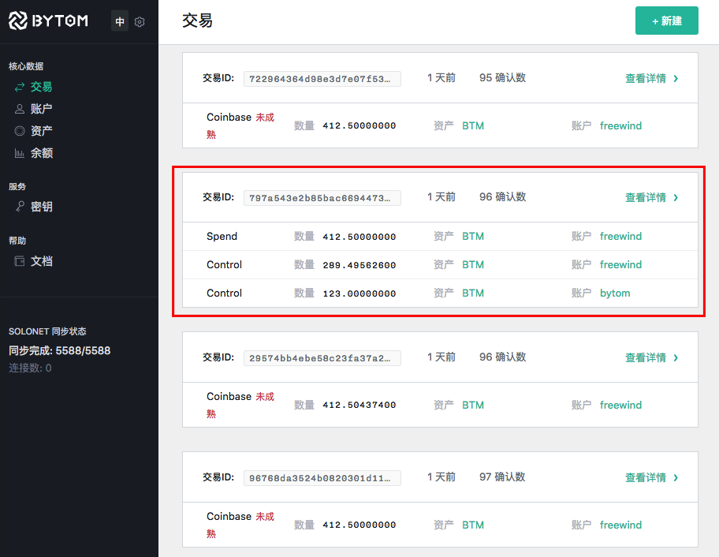

剥开比原看代码-比原是如何显示交易信息的
=================================

在前一篇文章中，我们试图理解比原是如何交易的，但是由于内容太多，我们把它分成了几个小问题，并在前一篇解决了“在dashboard中如何提交交易信息”，以及“比原后台是如何操作的”。

在本文我们继续研究下一个问题：在提交的交易成功完成后，前端会以列表的方式显示交易信息，它是如何拿到后台的数据的？也就是下图是如何实现的：



由于它同时涉及到了前端和后端，所以我们同样把它分成了两个小问题：

1. 前端是如何获取交易数据并显示出来的？
2. 后端是如何找到交易数据的？

1. 前端是如何获取交易数据并显示出来的？
--------------------------------

我们先在比原的前端代码库中寻找。由于这个功能是“列表分页”显示，这让我想起了前面有一个类似的功能是分页显示余额，那里用的是`src/features/shared/components/BaseList`提供的通用组件，所以这边应该也是一样。

经过查看，果然在`src/features/transactions/components/`下面发现了`List.jsx`文件，且目录结构跟`src/features/balances/components/`非常相似，再大略看一下代码，就能确定使用了一样的方法。

但是如果回想一下，过程似乎还是有点不同。在显示余额那里，是我们手动点击了左侧栏的菜单，使得前端的路由转到了`/balances`，然后由

https://github.com/freewind/bytom-dashboard-v1.0.0/blob/master/src/features/shared/routes.js#L5-L44

```js
const makeRoutes = (store, type, List, New, Show, options = {}) => {
  // ...
  return {
    path: options.path || type + 's',
    component: RoutingContainer,
    name: options.name || humanize(type + 's'),
    name_zh: options.name_zh,
    indexRoute: {
      component: List,
      onEnter: (nextState, replace) => {
        loadPage(nextState, replace)
      },
      onChange: (_, nextState, replace) => { loadPage(nextState, replace) }
    },
    childRoutes: childRoutes
  }

}
```

中的`onEnter`或者`onChange`触发了`loadPage`，最后一步步调用了后台接口`/list-balances`。而这次在本文的例子中，它是在提交了“提交交易”表单成功后，自动转到了“列表显示交易”的页面，会不会同样触发`onEnter`或者`onChange`呢？

答案是会的，因为在前文中，当`submitForm`执行后，向后台的最后一个请求`/submit-transaction`成功以后，会调用`dealSignSubmitResp`这个函数，而它的定义是：

[src/features/transactions/actions.js#L120-L132](https://github.com/freewind/bytom-dashboard-v1.0.0/blob/master/src/features/transactions/actions.js#L120-L132)

```js
const dealSignSubmitResp = resp => {
  // ...
  dispatch(push({
    pathname: '/transactions',
    state: {
      preserveFlash: true
    }
  }))
}
```

可以看到，它最后也会切换前端路由到`/transactions`，跟显示余额那里是完全一样的路线，所以按照那边的经验，到最后一定会访问后台的`/list-transactions`接口。

这过程中的推导就不再详说，需要的话可以看前面讲解“比原是如何显示余额的”那篇文章。

最后拿到了后台返回的数据如果以表格形式显示出来，在那篇文章中也提到，这里也跳过。

2. 后端是如何找到交易数据的？
------------------------

当我们知道了前端会访问后台的`/list-transactions`接口后，我们就很容易的在比原的主项目仓库中找到下面的代码：

[api/api.go#L164-L244](https://github.com/freewind/bytom-v1.0.1/blob/master/api/api.go#L164-L244)

```go
func (a *API) buildHandler() {
	// ...
	if a.wallet != nil {
		// ...
		m.Handle("/list-transactions", jsonHandler(a.listTransactions))
        // ...
}
```

可以看到，`list-transactions`对应的handler是`a.listTransactions`：

[api/query.go#L83-L107](https://github.com/freewind/bytom-v1.0.1/blob/master/api/query.go#L83-L107)

```js
func (a *API) listTransactions(ctx context.Context, filter struct {
	ID        string `json:"id"`
	AccountID string `json:"account_id"`
	Detail    bool   `json:"detail"`
}) Response {
	transactions := []*query.AnnotatedTx{}
	var err error

    // 1. 
	if filter.AccountID != "" {
		transactions, err = a.wallet.GetTransactionsByAccountID(filter.AccountID)
	} else {
		transactions, err = a.wallet.GetTransactionsByTxID(filter.ID)
	}

    // ...

    // 2.
	if filter.Detail == false {
		txSummary := a.wallet.GetTransactionsSummary(transactions)
		return NewSuccessResponse(txSummary)
	}
	return NewSuccessResponse(transactions)
}
```

从这个方法的参数可以看到，前端是可以传过来`id`，`account_id`和`detail`这三个参数的。而在本文的例子中，因为是直接跳转到`/transactions`的路由，所以什么参数也没有传上来。

我把代码分成了两块，一些错误处理的部分被我省略了。依次讲解：

1. 第1处是想根据参数来获取`transactions`。如果`account_id`有值，则拿它去取，即某个帐户拥有的交易；否则的话，用`id`去取，这个id指的是交易的id。如果这两个都没有值，应该是在第二个分支中处理，即`a.wallet.GetTransactionsByTxID`应该也可以处理参数为空字符串的情况
2. 第2处代码，如果`detail`为`false`（如果前端没传值，也应该是默认值`false`，则将前面拿到的`transactions`变成摘要，只返回部分信息；否则的话，返回完整信息。

我们先进第1处代码中的`a.wallet.GetTransactionsByAccountID`：

[wallet/indexer.go#L505-L523](https://github.com/freewind/bytom-v1.0.1/blob/master/wallet/indexer.go#L505-L523)

```go
func (w *Wallet) GetTransactionsByAccountID(accountID string) ([]*query.AnnotatedTx, error) {
	annotatedTxs := []*query.AnnotatedTx{}

    // 1.
	txIter := w.DB.IteratorPrefix([]byte(TxPrefix))
    defer txIter.Release()
    // 2.
	for txIter.Next() {
        // 3.
		annotatedTx := &query.AnnotatedTx{}
		if err := json.Unmarshal(txIter.Value(), &annotatedTx); err != nil {
			return nil, err
		}

        // 4.
		if findTransactionsByAccount(annotatedTx, accountID) {
			annotateTxsAsset(w, []*query.AnnotatedTx{annotatedTx})
			annotatedTxs = append(annotatedTxs, annotatedTx)
		}
	}

	return annotatedTxs, nil
}
```

这里把代码分成了4块：

1. 第1处代码是遍历数据库中以`TxPrefix`为前缀的值，其中`TxPrefix`为`TXS:`，下面要进行遍历。这里的`DB`无疑是`wallet`这个leveldb
2. 第2处开始进行遍历
3. 第3处是把每一个元素的`Value`拿出来，它是JSON格式的，把它转成`AnnotatedTx`对象。`txIter`的每一个元素是一个key-pair，有`Key()`，也有`Value()`，这里只用到了`Value()`
4. 第4处是在当前的这个`annotatedTx`对象中寻找，如果它的input或者output中包含的帐户的id等于`accountId`，则它是我们需要的。后面再使用`annotateTxsAsset`方法把`annotatedTx`对象中的asset相关的属性（比如`alias`等）补全。

其中`AnnotatedTx`的定义值得一看：

[blockchain/query/annotated.go#L12-L22](https://github.com/freewind/bytom-v1.0.1/blob/master/blockchain/query/annotated.go#L12-L22)

```go
type AnnotatedTx struct {
	ID                     bc.Hash            `json:"tx_id"`
	Timestamp              uint64             `json:"block_time"`
	BlockID                bc.Hash            `json:"block_hash"`
	BlockHeight            uint64             `json:"block_height"`
	Position               uint32             `json:"block_index"`
	BlockTransactionsCount uint32             `json:"block_transactions_count,omitempty"`
	Inputs                 []*AnnotatedInput  `json:"inputs"`
	Outputs                []*AnnotatedOutput `json:"outputs"`
	StatusFail             bool               `json:"status_fail"`
}
```

它其实就是为了持有最后返回给前端的数据，通过给每个字段添加JSON相关的`annotation`方便转换成JSON。

如果前端没有传`account_id`参数，则会进入另一个分支，对应`a.wallet.GetTransactionsByTxID(filter.ID)`：

[wallet/indexer.go#L426-L450](https://github.com/freewind/bytom-v1.0.1/blob/master/wallet/indexer.go#L426-L450)

```go
func (w *Wallet) GetTransactionsByTxID(txID string) ([]*query.AnnotatedTx, error) {
	annotatedTxs := []*query.AnnotatedTx{}
	formatKey := ""

	if txID != "" {
		rawFormatKey := w.DB.Get(calcTxIndexKey(txID))
		if rawFormatKey == nil {
			return nil, fmt.Errorf("No transaction(txid=%s) ", txID)
		}
		formatKey = string(rawFormatKey)
	}

	txIter := w.DB.IteratorPrefix(calcAnnotatedKey(formatKey))
	defer txIter.Release()
	for txIter.Next() {
		annotatedTx := &query.AnnotatedTx{}
		if err := json.Unmarshal(txIter.Value(), annotatedTx); err != nil {
			return nil, err
		}
		annotateTxsAsset(w, []*query.AnnotatedTx{annotatedTx})
		annotatedTxs = append([]*query.AnnotatedTx{annotatedTx}, annotatedTxs...)
	}

	return annotatedTxs, nil
}
```

这个方法看起来挺长，实际上逻辑比较简单。如果前端传了`txID`，则会在`wallet`中寻找指定的id的交易对象；否则的话，取出全部。其中`calcTxIndexKey(txID)`的定义是：

[wallet/indexer.go#L61-L63](https://github.com/freewind/bytom-v1.0.1/blob/master/wallet/indexer.go#L61-L63)

```go
func calcTxIndexKey(txID string) []byte {
	return []byte(TxIndexPrefix + txID)
}
```

其中`TxIndexPrefix`是`TID:`。

`calcAnnotatedKey(formatKey)`的定义是：

[wallet/indexer.go#L53-L55](https://github.com/freewind/bytom-v1.0.1/blob/master/wallet/indexer.go#L53-L55)

```go
func calcAnnotatedKey(formatKey string) []byte {
	return []byte(TxPrefix + formatKey)
}
```

其中`TxPrefix`的值是`TXS:`。

我们再进入`listTransactions`的第2处，即`detail`那里。如果`detail`为`false`，则只需要摘要，所以会调用`a.wallet.GetTransactionsSummary(transactions)`：

[wallet/indexer.go#L453-L486](https://github.com/freewind/bytom-v1.0.1/blob/master/wallet/indexer.go#L453-L486)

```go
func (w *Wallet) GetTransactionsSummary(transactions []*query.AnnotatedTx) []TxSummary {
	Txs := []TxSummary{}

	for _, annotatedTx := range transactions {
		tmpTxSummary := TxSummary{
			Inputs:    make([]Summary, len(annotatedTx.Inputs)),
			Outputs:   make([]Summary, len(annotatedTx.Outputs)),
			ID:        annotatedTx.ID,
			Timestamp: annotatedTx.Timestamp,
		}

		for i, input := range annotatedTx.Inputs {
			tmpTxSummary.Inputs[i].Type = input.Type
			tmpTxSummary.Inputs[i].AccountID = input.AccountID
			tmpTxSummary.Inputs[i].AccountAlias = input.AccountAlias
			tmpTxSummary.Inputs[i].AssetID = input.AssetID
			tmpTxSummary.Inputs[i].AssetAlias = input.AssetAlias
			tmpTxSummary.Inputs[i].Amount = input.Amount
			tmpTxSummary.Inputs[i].Arbitrary = input.Arbitrary
		}
		for j, output := range annotatedTx.Outputs {
			tmpTxSummary.Outputs[j].Type = output.Type
			tmpTxSummary.Outputs[j].AccountID = output.AccountID
			tmpTxSummary.Outputs[j].AccountAlias = output.AccountAlias
			tmpTxSummary.Outputs[j].AssetID = output.AssetID
			tmpTxSummary.Outputs[j].AssetAlias = output.AssetAlias
			tmpTxSummary.Outputs[j].Amount = output.Amount
		}

		Txs = append(Txs, tmpTxSummary)
	}

	return Txs
}
```

这一段的代码相当直白，就是从`transactions`的元素中取出部分比较重要的信息，组成新的`TxSummary`对象，返回过去。最后，这些对象再变成JSON返回给前端。

那么今天的这个小问题就算解决了，今天比较简单。
